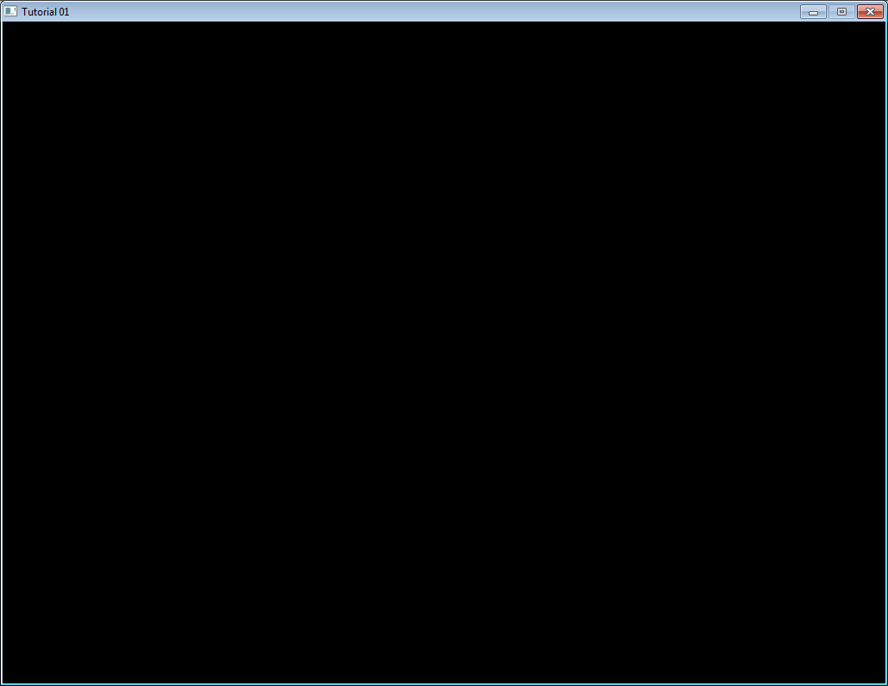

Introduction
------------

All tutorials can be built on Windows, Linux and Mac. For all these platforms,
the procedure is roughly the same:

- Update your drivers!
- Download a compiler, if you don’t already have one.
- Install CMake
- Download the source code
- Generate a project using CMake
- Build the project using your compiler

Detailed procedures will now be given for each platform. Adaptations may be
required. If unsure, read the instruction for Windows and try to adapt them.

Building on Windows
-------------------

-   Updating your drivers should be easy. Just go to NVIDIA’s or AMD’s
    website and download the drivers. If unsure about your GPU model :
    Control Panel -\> System and Security -\> System -\> Device
    Manager -\> Display adapter. If you have an integrated Intel GPU,
    drivers are usually provided by your OEM (Dell, HP, …).
-   We suggest using Visual Studio 2017 Express for Desktop as a
    compiler. You can download it for free
    [here](https://www.visualstudio.com/en-US/products/visual-studio-express-vs).
    MAKE SURE YOU CHOOSE CUSTOM INSTALLATION AND CHECK C++. If you
    prefer using MinGW, we recommend using [Qt
    Creator](http://qt-project.org/). Install whichever you want.
    Subsequent steps will be explained with Visual Studio, but should be
    similar with any other IDE.
-   Download
    [CMake](http://www.cmake.org/cmake/resources/software.html)from here
    and install it
-   [Download the source code](http://www.opengl-tutorial.org/download/)
    and unzip it, for instance in
    C:\\Users\\XYZ\\Projects\\OpenGLTutorials\\ .
-   Launch CMake. In the first line, navigate to the unzipped folder. If
    unsure, choose the folder that contains the CMakeLists.txt file. In
    the second line, enter where you want all the compiler’s stuff to
    live. For instance, you can choose
    C:\\Users\\XYZ\\Projects\\OpenGLTutorials-build-Visual2017-64bits\\,
    or
    C:\\Users\\XYZ\\Projects\\OpenGLTutorials\\build\\Visual2017-32bits.
    Notice that it can be anywhere, not necessarily in the same folder.
    

-   Click on the Configure button. Since this is the first time you
    configure the project, CMake will ask you which compiler you would
    like to use. Choose wisely depending on step 1. If you have a 64 bit
    Windows, you can choose 64 bits; if you don’t know, choose 32 bits.
-   Click on Configure until all red lines disappear. Click on Generate.
    Your Visual Studio project is now created. You can now forget about
    CMake.
-   Open
    C:\\Users\\XYZ\\Projects\\OpenGLTutorials-build-Visual2010-32bits.
    You will see a Tutorials.sln file : open it with Visual Studio.
    

In the *Build* menu, click *Build All*. Every tutorial and dependency
will be compiled. Each executable will also be copied back into
C:\\Users\\XYZ\\Projects\\OpenGLTutorials\\ . Hopefuly no error occurs.

-   Open C:\\Users\\XYZ\\Projects\\OpenGLTutorials\\playground, and
    launch playground.exe. A black window should appear.
    

You can also launch any tutorial from inside Visual Studio. Right-click
on Playground once, “Choose as startup project”. You can now debug the
code by pressing F5.

Building on Linux
-----------------

They are so many Linux variants out there that it’s impossible to list
every possible platform. Adapt if required, and don’t hesitate to read
your distribution’s documentation.

-   Install the latest drivers. We highly recommend the closed-source
    binary drivers. It’s not GNU or whatever, but they work. If your
    distribution doesn’t provide an automatic install, try [Ubuntu’s
    guide](http://help.ubuntu.com/community/BinaryDriverHowto).
-   Install all needed compilers, tools & libs. Complete list is :
    *cmake make g++ libx11-dev libxi-dev libgl1-mesa-dev
    libglu1-mesa-dev libxrandr-dev libxext-dev libxcursor-dev
    libxinerama-dev libxi-dev* . Use
    `sudo apt-get install *****`{.highlighter-rouge} or
    `su && yum install ******`{.highlighter-rouge}.
-   [Download the source code](http://www.opengl-tutorial.org/download/)
    and unzip it, for instance in \~/Projects/OpenGLTutorials/
-   cd in \~/Projects/OpenGLTutorials/ and enter the following commands
    :

-   mkdir build
-   cd build
-   cmake ..

-   A makefile has been created in the build/ directory.
-   type “make all”. Every tutorial and dependency will be compiled.
    Each executable will also be copied back into
    \~/Projects/OpenGLTutorials/ . Hopefuly no error occurs.
-   Open \~/Projects/OpenGLTutorials/playground, and launch
    ./playground. A black window should appear.

Note that you really should use an IDE like [Qt
Creator](http://qt-project.org/). In particular, this one has built-in
support for CMake, and it will provide a much nicer experience when
debugging. Here are the instructions for QtCreator :

-   In QtCreator, go to File-\>Tools-\>Options-\>Compile&Execute-\>CMake
-   Set the path to CMake. This is most probably /usr/bin/cmake
-   File-\>Open Project; Select tutorials/CMakeLists.txt
-   Select a build directory, preferably outside the tutorials folder
-   Optionally set -DCMAKE\_BUILD\_TYPE=Debug in the parameters box.
    Validate.
-   Click on the hammer on the bottom. The tutorials can now be launched
    from the tutorials/ folder.
-   To run the tutorials from QtCreator, click on Projects-\>Execution
    parameters-\>Working Directory, and select the directory where the
    shaders, textures & models live. Example for tutorial 2 :
    \~/opengl-tutorial/tutorial02\_red\_triangle/

Building on Mac
---------------

The procedure is very similar to Windows’ (Makefiles are also supported,
but won’t be explained here) :

-   Install XCode from the Mac App Store
-   [Download
    CMake](http://www.cmake.org/cmake/resources/software.html), and
    install the .dmg . You don’t need to install the command-line tools.
-   [Download the source code](http://www.opengl-tutorial.org/download/)
    and unzip it, for instance in \~/Projects/OpenGLTutorials/ .
-   Launch CMake (Applications-\>CMake). In the first line, navigate to
    the unzipped folder. If unsure, choose the folder that contains the
    CMakeLists.txt file. In the second line, enter where you want all
    the compiler’s stuff to live. For instance, you can choose
    \~/Projects/OpenGLTutorials\_bin\_XCode/. Notice that it can be
    anywhere, not necessarily in the same folder.
-   Click on the Configure button. Since this is the first time you
    configure the project, CMake will ask you which compiler you would
    like to use. Choose Xcode.
-   Click on Configure until all red lines disappear. Click on Generate.
    Your Xcode project is now created. You can forget about CMake.
-   Open \~/Projects/OpenGLTutorials\_bin\_XCode/ . You will see a
    Tutorials.xcodeproj file : open it.
-   Select the desired tutorial to run in Xcode’s Scheme panel, and use
    the Run button to compile & run :

Note for Code::Blocks
---------------------

Due to 2 bugs (one in C::B, one in CMake), you have to edit the
command-line in Project-\>Build Options-\>Make commands, as follows :

You also have to setup the working directory yourself :
Project-\>Properties -\> Build targets -\> tutorial N -\> execution
working dir ( it’s src\_dir/tutorial\_N/ ).
